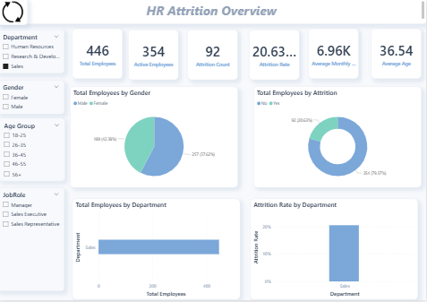
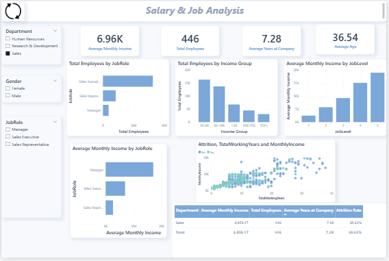
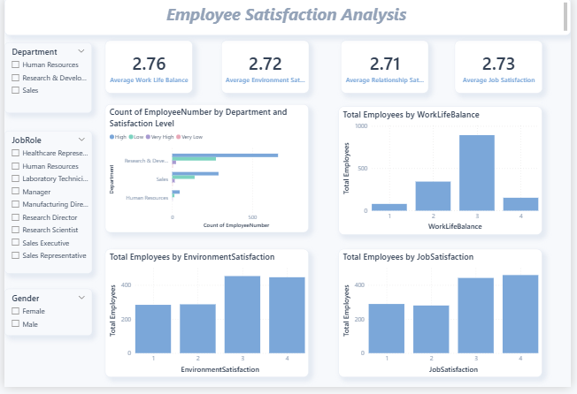
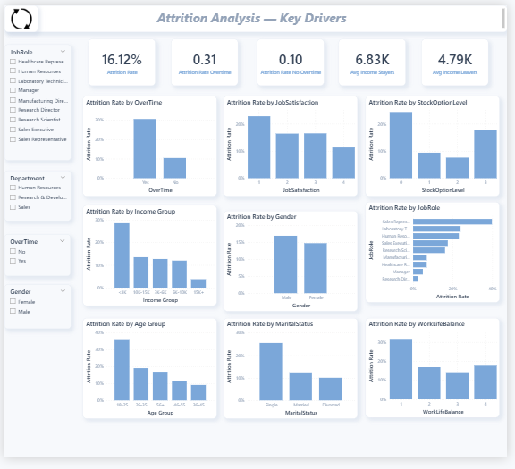
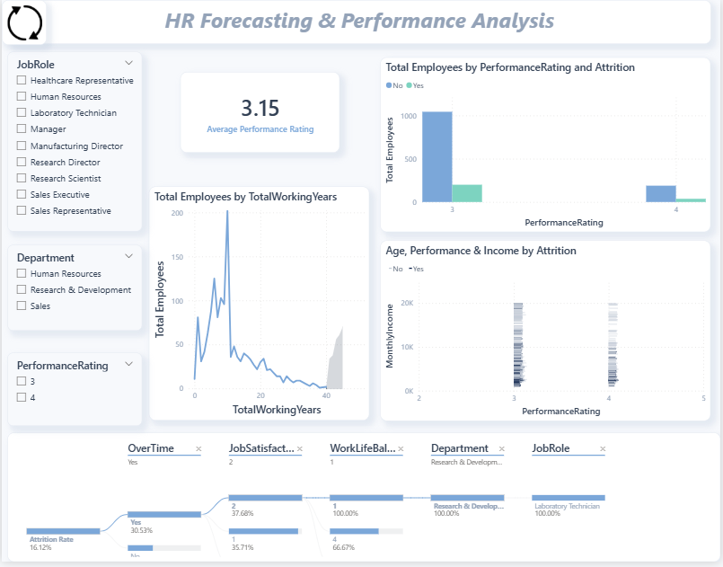

# CodeAlpha HR Analytics Dashboard

## 📊 Project Overview
An interactive HR Analytics Dashboard built with Power BI, analyzing employee attrition, satisfaction, performance, and forecasting trends for a company with 1,470 employees.

## 🎯 Task
**CodeAlpha Power BI Internship — Task 2: Human Resources Analytics**

## 📁 Project Files
| File | Description |
|------|-------------|
| `HR_Attrition_Dashboard.pbix` | Main Power BI Dashboard (5 pages) |
| `HR_Attrition_Dashboard.pdf` | Dashboard export as PDF |
| `HR_Employee_Attrition_Cleaned.csv` | Cleaned dataset |
| `Insights.docx` | Key insights and recommendations |
| `ScreenShots/` | Dashboard preview images |

## 📈 Dashboard Pages
1. **Overview** — KPIs and general statistics
2. **Salary Analysis** — Income distribution by role and level
3. **Satisfaction Analysis** — Job, environment, and relationship satisfaction
4. **Attrition Analysis** — Key attrition drivers
5. **Forecasting & Performance** — Predictive analytics and performance review

## 🔍 Key Insights
- **Overall Attrition Rate:** 16.12%
- **Overtime employees are 3x more likely to leave** (~30% vs ~10%)
- **Poor Work-Life Balance** → highest attrition driver (~31%)
- **Low Job Satisfaction** → ~23% attrition
- **Laboratory Technicians and Sales Representatives** have the highest turnover
- **Employees aged 18–25** are most likely to leave

## 🛠 Tools Used
- Power BI Desktop
- Power Query (Data Cleaning)
- DAX (Measures & Calculated Columns)

## 📸 Screenshots

## 🔗 Connect
- LinkedIn: [Your LinkedIn Profile]
- GitHub: [Your GitHub Profile]

## 🏷️ Tags
#CodeAlpha #PowerBI #HRAnalytics #DataAnalytics #DataVisualization #Internship
